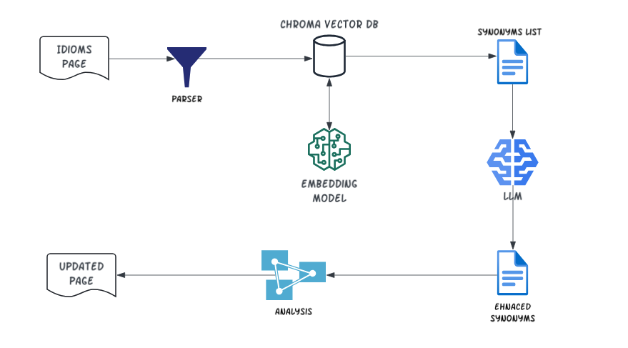

# most-common-american-idioms-with-synonyms

This project is based on [@xiaolai](https://github.com/xiaolai)'s work -  [most-common-american-idioms](https://github.com/xiaolai/most-common-american-idioms). The [most-common-american-idioms](https://github.com/xiaolai/most-common-american-idioms) book is a great tool to learn English idioms. While enjoying the learning experience, it would be even better to have synonyms so we can learn by analogy. This project is designed to enhance the idiom book with synonyms links. 

It uses [Sentence Embedding](https://en.wikipedia.org/wiki/Sentence_embedding) to find synonyms backed by the [Chroma](https://docs.trychroma.com/) Vector DB. Embedding and Vector DB are key elements in Retrieval Augmented Generation (RAG) to retrieve similar documents for more context before feeding into an Large Language Model (LLM) model. Here it uses the vector DB to find synonyms in the first round.

The synonyms found from the vector DB may not all ideal. Some may not appropriate in the context or some out of list phrases may be more similar. In the second round, it uses LLM (OpenAI API) to enhance the synonyms list in two ways:
1. Feed the LLM with two level synonyms and ask the LLM to choose more appropriate ones
2. Ask the LLM to add more synonyms out of the list if there are ones


## How it works
Please also check the Medium article [A RAG Application to Find Synonyms](https://medium.com/@yuxiaojian/a-rag-application-to-find-synonyms-005e3afae6f8)
<p align="center">
  
</p>

## Usage

Copy the *Most_Common_American_Idioms.html* to the current folder. 

1. Install Python dependencies. 
```bash
pip install -r requirements
```

1. (Optional) Parse the html
It will parse *Most_Common_American_Idioms.html* and generate a JSON file for future usages. The repo contains the JSON file up to July 2024. You only need to prase again if the *Most_Common_American_Idioms.html* is updated afterward. 
```bash
python idioms_synonyms.py parse-html
```

2. (Optional) Create the Vector DB index
If the *Most_Common_American_Idioms.html* is update. Please delete the *idioms-db* folder and run this command to create the vector DB again
```bash
python idioms_synonyms.py create-db
```

3. (Optional) Generate synonyms from the Vector DB index 
It will create `synonyms.json` file with all the synonyms found from the vector DB query

```bash
python idioms_synonyms.py find-synonyms
```

4. (Optional) Enhance the synonym list with LLM 
You will need an Open API key to run this step. It enhances the synonyms list by
1. Feed the LLM with two level synonyms and ask the LLM to select top ones
2. Ask the LLM to add more synonyms out of the list
```bash
python idioms_synonyms.py llm-refiner
```

5. Update the html with synonyms links
This step requires the synonyms JSON file. Specify `-l` to use the LLM enhanced synonyms list or it will use the synonyms list from the vector DB. It will create *Most_Common_American_Idioms_With_Synonyms.html*
```bash
python idioms_synonyms.py update-html -l
```

6. Copy the *Most_Common_American_Idioms_With_Synonyms.html* back to your local [most-common-american-idioms](https://github.com/xiaolai/most-common-american-idioms) and open it in a browser. 

## Enjoy the learning
<p align="center">
  
</p>